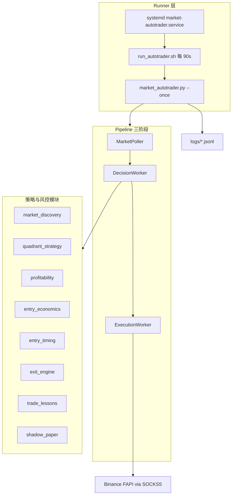

# Market Autotrader — VPS 开发与运维文档

> 面向在 **VPS `154.219.123.15:58231`** 上继续完善本系统的开发说明。  
> 项目路径：`/home/deploy/market-autotrader`  
> 最后更新：2026-06-24

---

## 1. 系统是什么

Binance U 本位合约 **全自动交易智能体**，设计目标：

| 目标 | 实现方式 |
|------|----------|
| 全天自动运行 | systemd + `deploy/run_autotrader.sh` 循环 `--once` |
| 敏锐感知市场 | Discovery 动态标的 + Regime/MTF/RSRS + `market_context` |
| 高自主、少情绪 | 硬风控闸门 + `trade_lessons` + 决策 JSONL 账本 |
| 每笔有理由 | `trade_rationale` 结构化字段写入 `logs/market-autotrader-live-decisions.jsonl` |

**当前生产配置**：`market_autotrader.vps.json`（VPS 直连远端 SOCKS，无本机 SSH jump）。

---

## 2. 架构总览



### 入口与委托关系

- **主入口**：`market_autotrader.py` → `run_once()`
- 当 `pipeline.enabled: true` 时，委托 `trading_pipeline.TradingPipeline.run_cycle()`
- 否则走 `_run_once_monolithic()`（单进程路径，测试/降级用）

---

## 3. 目录结构（开发时重点）

```
/home/deploy/market-autotrader/
├── market_autotrader.py      # 核心：信号、风控、下单、账户、类型定义
├── trading_pipeline.py       # Poller → Decision → Execution
├── market_discovery.py       # 涨跌幅榜 / 成交额 / executable 排名
├── quadrant_strategy.py      # 四象限入场（trend/reversal）
├── profitability.py          # 软 regime、日损预算
├── entry_economics.py          # 手续费门槛、losers_soft 做空策略
├── entry_timing.py             # 智能限价 / chase_fill / IOC
├── exit_engine.py              # 持仓出场、峰值回撤
├── trade_lessons.py            # 历史教训规则
├── trade_outcomes.py           # 平仓学习闭环
├── shadow_paper.py             # Shadow + blocked counterfactual
├── growth_sizing.py            # 权益比例仓位、portfolio heat
├── asset_profile.py            # 分档杠杆、account_max_leverage
├── bucket_strategy.py          # 按 discovery 桶的 MTF 门槛
├── proxy_http.py               # SOCKS5（应用层，不走系统代理）
├── benchmark_gate.py           # BTC 回撤熔断
├── market_context.py           # 宏观 / Fear&Greed / funding
├── trading_costs.py            # 手续费、资金费
├── realtime_supervisor.py      # 只读监督（可选第二进程）
├── trading_dashboard.py        # 本地 Web 控制台 :8765（可选）
│
├── market_autotrader.growth.example.json   # Windows 本地完整参考配置
├── market_autotrader.vps.json              # VPS 生产配置（无 jump tunnel）
├── config/pinned-symbols.json              # Pin 标的持久化
│
├── deploy/
│   ├── run_autotrader.sh           # 生产循环脚本
│   ├── install_vps.sh              # 依赖安装
│   └── market-autotrader.service   # systemd 单元
├── scripts/
│   ├── check_trading_health.py     # Windows 健康检查
│   ├── analyze_trade_lessons.py
│   └── rebuild_ma_v3.py            # 从 diff 重建 core（灾难恢复用）
├── tests/                          # unittest，157+ 用例
└── logs/                           # 运行时产物（勿提交 git）
```

---

## 4. 核心模块职责速查

| 模块 | 职责 | 典型配置键 |
|------|------|------------|
| `market_discovery` | 扫描 universe、regime 过滤、top N executable | `market_discovery.*` |
| `quadrant_strategy` | trend_long/short、reversal；Losers 才 trend_short | `quadrant_strategy.*` |
| `profitability` | `regime_filter_mode: soft`、gainers/losers 放宽 | `profitability.*` |
| `entry_economics` | `discovery_short_mode: losers_soft`、suppress 非法 SELL | `strategy.discovery_short_mode` |
| `entry_timing` | `chase_fill` / `smart_limit`、`limit_time_in_force: IOC` | `entry_timing.*` |
| `exit_engine` | 峰值回撤、分批止盈、supervisor 偏置 | `strategy.holding_*` |
| `trade_lessons` | 禁追多、禁空涨幅榜、squeeze | `trade_lessons.*` |
| `shadow_paper` | Losers 桶 shadow_first、counterfactual | `shadow_paper.*` |
| `growth_sizing` | `risk_per_trade_pct`、heat、30 万目标 | `risk.target_equity_quote` |

**决策数据流（单标的）**：

1. Poller 拉 K 线 + discovery 快照 + benchmark + context  
2. `build_signal()` → `apply_quadrant_signal()` → `suppress_ineligible_discovery_short()`  
3. `apply_risk_controls()` + lessons + profitability + bucket  
4. `build_order_intent()` → `enrich_order_intent()`（entry_timing）  
5. ExecutionWorker → Binance FAPI（live）或 paper  

---

## 5. 配置文件说明

### 5.1 两份主配置

| 文件 | 用途 |
|------|------|
| `market_autotrader.growth.example.json` | Windows 开发：含 `ssh_jump_tunnel` → `127.0.0.1:19498` |
| `market_autotrader.vps.json` | VPS 生产：SOCKS 直连 `103.227.166.183:9498`，`ssh_jump_tunnel.enabled: false` |

systemd 通过环境变量指定配置：

```ini
Environment=CONFIG=market_autotrader.vps.json
Environment=LOOP_DELAY=90
EnvironmentFile=-/home/deploy/market-autotrader/.env
```

### 5.2 环境变量（`.env`，权限 600）

```bash
BINANCE_API_KEY=...
BINANCE_API_SECRET=...
# 可选覆盖 SOCKS（vps.json 里写 env:BINANCE_SOCKS5_PROXY）
BINANCE_SOCKS5_PROXY=<socks5-url-from-provider>
```

配置里 API 引用写法：`"api_key": "env:BINANCE_API_KEY"`（由 `expand_env()` 解析）。

### 5.3 Live 三道机械闸门

| 闸门 | 条件 |
|------|------|
| 配置 | `risk.mode=live` + `execution.mode=live` + `allow_live_trading=true` |
| Arm 文件 | `logs/live-trading.armed` 存在，且 JSON `expires_at` 未过期 |
| Kill 文件 | **不得**存在 `logs/live-trading.kill` |

---

## 6. VPS 日常开发流程

### 6.1 SSH 登录

```bash
ssh -p 58231 -i ~/.ssh/vps_154 deploy@154.219.123.15
cd /home/deploy/market-autotrader
```

（Windows 可用 Cursor SSH Remote，或 `~/.cursor/skills/ssh` 的 `relay-15` 别名。）

### 6.2 改代码 → 测 → 上线

```bash
# 1. 编辑（vim / nano / rsync / git pull）
vim trading_pipeline.py

# 2. 语法检查
python3 -m py_compile market_autotrader.py trading_pipeline.py

# 3. 跑测试（推荐改模块相关用例）
python3 -m pytest tests/test_trading_pipeline.py tests/test_entry_economics.py -q

# 4. 单次干跑（不循环、不写 systemd）
python3 -u market_autotrader.py --config market_autotrader.vps.json --once | tail -5

# 5. 重启生产
sudo systemctl restart market-autotrader
sudo systemctl status market-autotrader --no-pager
```

### 6.3 从本机同步代码到 VPS

**方式 A — 打 tar 包（与初次部署相同）**

```powershell
# Windows 本机
cd "C:\Users\16643\Documents\bi an"
tar -czf ..\market-autotrader-deploy.tgz `
  --exclude=logs --exclude=__pycache__ --exclude=.venv `
  --exclude=.env --exclude="_*" .
```

```bash
# 上传后 VPS 上
cd /home/deploy/market-autotrader
tar -xzf ~/market-autotrader-deploy.tgz
# 保留 .env 和 logs/ 不要被覆盖
sudo systemctl restart market-autotrader
```

**方式 B — 只同步单文件（SFTP / ssh_upload.py）**

用 SSH skill 上传改动的 `.py` / `.json`，然后 `systemctl restart`。

**注意**：永远不要把 `.env` 或含密钥的 `market_autotrader.live.json` 打进 tar 上传。

### 6.4 Git（建议后续补上）

当前 VPS 目录可能无 git 历史。建议在 GitHub/Gitee 建私有仓，VPS 上：

```bash
cd /home/deploy/market-autotrader
git init && git remote add origin <私有仓库>
# .gitignore 至少包含：.env logs/ __pycache__/ .venv/
```

---

## 7. 日志与调试

### 7.1 关键日志文件

| 路径 | 内容 |
|------|------|
| `logs/market-autotrader-live-decisions.jsonl` | **主账本**：每笔/每次 blocked 的完整 JSON |
| `logs/market-autotrader.stdout.log` | 每轮 `--once` 的 print 输出 |
| `logs/market-autotrader.stderr.log` | 异常栈 |
| `logs/market-autotrader-runner.log` | 循环起止时间 |
| `logs/market-autotrader-heartbeat.txt` | 最近心跳时间 |
| `logs/market-discovery-latest.json` | Discovery 快照 |
| `logs/pipeline/*.json` | Pipeline handoff（Poller/Decision/Execution） |
| `logs/trade-learning-state.json` | 学习状态、桶 live/shadow 模式 |
| `logs/shadow-blocked-counterfactual.jsonl` | 被拦单的 counterfactual |

### 7.2 常用排查命令

```bash
# 实时决策
tail -f logs/market-autotrader-live-decisions.jsonl

# 最近一轮是否 pipeline 报错
tail -20 logs/market-autotrader.stdout.log | grep -E 'pipelineError|socks5Proxy|liveTrading'

# 统计 blocked 原因 Top
python3 - <<'PY'
import json, collections
from pathlib import Path
c = collections.Counter()
for line in Path("logs/market-autotrader-live-decisions.jsonl").read_text().splitlines()[-200:]:
    d = json.loads(line)
    for r in d.get("blocked_reasons") or []:
        c[r.split(":")[0][:50]] += 1
for k, v in c.most_common(15):
    print(v, k)
PY

# SOCKS 是否生效（应看到 103.227.166.183:9498，而非 127.0.0.1:19498）
grep socks5Proxy logs/market-autotrader.stdout.log | tail -1
```

### 7.3 理解「为什么没开仓」

按频率从高到低查：

1. `Strategy chose HOLD` — 信号层不出单  
2. `Discovery non-executable` — 未进 top N 或 regime/score gate  
3. `Trade lesson` / `RSI overheated` / `Pump guard` — 风控与教训  
4. `Discovery short policy (losers_soft)` — 非 Losers 桶禁止 discovery 做空  
5. `Live trading not armed` — 未 arm（已 arm 则跳过）  
6. `Futures available margin below reserve` — 保证金不足  

---

## 8. 运维命令速查

```bash
# 服务
sudo systemctl status market-autotrader
sudo systemctl restart market-autotrader
sudo journalctl -u market-autotrader -n 50 --no-pager

# Live 闸门
pwsh ./arm_live_trading.ps1 -Hours 8  # 允许 live 下单（JSON arm，默认 8 小时过期）
rm logs/live-trading.armed            # 禁止新开（仅分析）
touch logs/live-trading.kill       # 紧急：等同 kill switch
rm logs/live-trading.kill

# 停止循环（不卸 systemd）
touch logs/market-autotrader.stop
sudo systemctl stop market-autotrader

# 恢复循环
rm -f logs/market-autotrader.stop logs/live-trading.kill
sudo systemctl start market-autotrader
```

---

## 9. 测试

```bash
# 全量（约 30s）
python3 -m pytest tests/ -q

# 按域
python3 -m pytest tests/test_quadrant_strategy.py tests/test_entry_economics.py -q
python3 -m pytest tests/test_trading_pipeline.py -q
python3 -m pytest tests/test_profitability.py -q
```

**Windows 本机**：`scripts/check_trading_health.py` 检查三进程 PID（autotrader / supervisor / dashboard）；VPS 上改用 `systemctl` + 上文日志命令。

---

## 10. 常见开发任务指南

### 10.1 提高开仓率（谨慎）

| 杠杆 | 配置项 | 风险 |
|------|--------|------|
| 放宽 discovery 名额 | `market_discovery.max_discovered_trades_per_cycle` | 扫描更多标的 |
| Gainers 追多 | `profitability.gainers_allow_*`、`trade_lessons` 追多规则 | 追涨回撤 |
| Losers live | `trade_learning.bucket_live_mode_overrides.futuresLosers: live` | 该桶历史 WR 低 |
| 降低信心门槛 | `strategy.min_buy_confidence` | 假信号增多 |

改完 **必须** `--once` 干跑 + 看 `blocked_reasons` 分布再 restart。

### 10.2 新增一个策略模块

1. 新建 `my_module.py`，提供 `*_from_config(raw) -> Config` 与纯函数  
2. 在 `trading_pipeline.DecisionWorker` 或 `apply_risk_controls` 接线  
3. 在 `market_autotrader.vps.json` 增加配置段  
4. 添加 `tests/test_my_module.py`  
5. VPS 部署 + `pytest` + `systemctl restart`

### 10.3 调整出场逻辑

改 `exit_engine.py` → `apply_holding_priority_signal` 在 `market_autotrader` / pipeline 持仓路径调用。

### 10.4 代理问题

| 环境 | 正确代理 |
|------|----------|
| Windows 本地 | `ssh_jump_tunnel` + `socks5://...@127.0.0.1:19498` |
| VPS | **关闭** jump，`socks5://...@103.227.166.183:9498` |

症状：`pipelineError ... Connection refused 127.0.0.1:19498` → VPS 误用了本地 jump 配置。

---

## 11. 安全规范（强制）

1. **密钥只放** `/home/deploy/market-autotrader/.env`，`chmod 600`，不进 git、不进 tar、不进聊天  
2. Binance API：**禁止提现**，建议 IP 白名单绑 VPS 出口  
3. 轮换密钥后：`vim .env` → `sudo systemctl restart market-autotrader`  
4. 生产改动先在 `--once` 验证，再 restart；重大改动先 `rm logs/live-trading.armed` 观察一轮  
5. `logs/live-trading.kill` 随时可用，不必等改代码  

---

## 12. 灾难恢复

本项目曾整夹误删，恢复路径：

1. Cursor transcript → `restore_from_transcript.py`（恢复 70+ 文件）  
2. agent-tools git diff → `scripts/rebuild_ma_v3.py`（重建 `market_autotrader.py`）  
3. 清单见 `RECOVERY_MANIFEST.md`  

**建议**：尽快 `git init` + 私有远程，避免再次全丢。

---

## 13. 可选组件（未在 VPS systemd 默认启用）

| 组件 | 启动方式 | 端口 |
|------|----------|------|
| `realtime_supervisor.py` | `python3 realtime_supervisor.py --config realtime_supervisor.example.json` | — |
| `trading_dashboard.py` | `python3 trading_dashboard.py` | 8765 |

若要 7×24 监督 + Web 台，可另建 `market-autotrader-supervisor.service`，参考 `start_autonomous_trading.ps1`（Windows 版三件套）。

---

## 14. 开发检查清单（每次改完）

- [ ] `python3 -m py_compile` 改动文件  
- [ ] 相关 `pytest` 通过  
- [ ] `python3 market_autotrader.py --config market_autotrader.vps.json --once` 无 `pipelineError`  
- [ ] `grep account.refresh` 决策日志无新 API 错误  
- [ ] `sudo systemctl restart market-autotrader`  
- [ ] `tail` 决策账本确认行为符合预期  

---

## 15. 联系与约定

- **主配置（VPS）**：`market_autotrader.vps.json`  
- **决策账本**：`logs/market-autotrader-live-decisions.jsonl`  
- **循环间隔**：90s（`LOOP_DELAY` / `poll_seconds`）  
- **学习状态**：`logs/trade-learning-state.json`（Losers 默认 `shadow_first`）  

有问题先查 **第 7 节日志** 与 **第 10.3 节 blocked 分层**，再改配置或代码。
